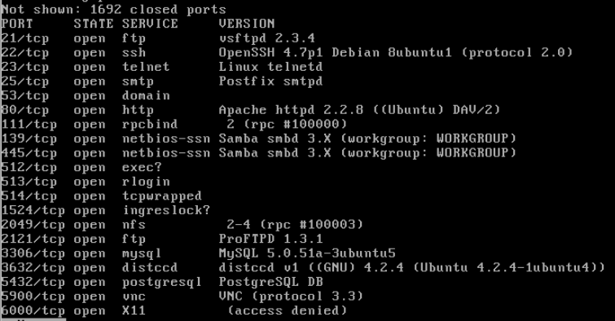
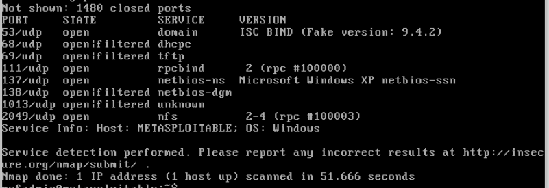

# Домашнее задание к занятию «Уязвимости и атаки на информационные системы»

### Инструкция по выполнению домашнего задания

1. Сделайте fork [репозитория c шаблоном решения](https://github.com/netology-code/sys-pattern-homework) к себе в Github и переименуйте его по названию или номеру занятия, например, https://github.com/имя-вашего-репозитория/gitlab-hw или https://github.com/имя-вашего-репозитория/8-03-hw).
2. Выполните клонирование этого репозитория к себе на ПК с помощью команды `git clone`.
3. Выполните домашнее задание и заполните у себя локально этот файл README.md:
   - впишите вверху название занятия и ваши фамилию и имя;
   - в каждом задании добавьте решение в требуемом виде: текст/код/скриншоты/ссылка;
   - для корректного добавления скриншотов воспользуйтесь инструкцией [«Как вставить скриншот в шаблон с решением»](https://github.com/netology-code/sys-pattern-homework/blob/main/screen-instruction.md);
   - при оформлении используйте возможности языка разметки md. Коротко об этом можно посмотреть в [инструкции по MarkDown](https://github.com/netology-code/sys-pattern-homework/blob/main/md-instruction.md).
4. После завершения работы над домашним заданием сделайте коммит (`git commit -m "comment"`) и отправьте его на Github (`git push origin`).
5. Для проверки домашнего задания преподавателем в личном кабинете прикрепите и отправьте ссылку на решение в виде md-файла в вашем Github.
6. Любые вопросы задавайте в чате учебной группы и/или в разделе «Вопросы по заданию» в личном кабинете.

Желаем успехов в выполнении домашнего задания.

------

### Задание 1

Скачайте и установите виртуальную машину Metasploitable: https://sourceforge.net/projects/metasploitable/.

Это типовая ОС для экспериментов в области информационной безопасности, с которой следует начать при анализе уязвимостей.

Просканируйте эту виртуальную машину, используя **nmap**.

Попробуйте найти уязвимости, которым подвержена эта виртуальная машина.

Сами уязвимости можно поискать на сайте https://www.exploit-db.com/.

Для этого нужно в поиске ввести название сетевой службы, обнаруженной на атакуемой машине, и выбрать подходящие по версии уязвимости.

Ответьте на следующие вопросы:

- Какие сетевые службы в ней разрешены?
- Какие уязвимости были вами обнаружены? (список со ссылками: достаточно трёх уязвимостей)
  
*Приведите ответ в свободной форме.*  

#### Список доступных сетевых TCP служб

#### Список доступных сетевых UDP служб

#### Список нескольких уязвимостей

- [vsftpd 2.3.4 - Backdoor Command Execution](https://www.exploit-db.com/exploits/49757)
- [TelnetD encrypt_keyid - Function Pointer Overwrite](https://www.exploit-db.com/exploits/18280)
- [ProFTPd IAC 1.3.x - Remote Command Execution](https://www.exploit-db.com/exploits/15449)

### Задание 2

Проведите сканирование Metasploitable в режимах SYN, FIN, Xmas, UDP.

Запишите сеансы сканирования в Wireshark.

Ответьте на следующие вопросы:

- Чем отличаются эти режимы сканирования с точки зрения сетевого трафика?
- Как отвечает сервер?

*Приведите ответ в свободной форме.*

Режимы сканирования SYN, FIN, Xmas и UDP отличаются друг от друга по способу взаимодействия с сервером и генерации сетевого трафика.

SYN сканирование: В этом режиме сканер отправляет пакеты с установленным флагом SYN (синхронизация) на открытые порты сервера. Если порт открыт, сервер отвечает пакетом с установленными флагами SYN и ACK (подтверждение синхронизации). Если порт закрыт, сервер отвечает пакетом с установленным флагом RST (сброс соединения). Таким образом, SYN сканирование позволяет определить открытые и закрытые порты на сервере.

FIN сканирование: В этом режиме сканер отправляет пакеты с установленным флагом FIN (завершение соединения) на открытые порты сервера. Если порт открыт, сервер должен отправить пакет с установленным флагом RST, чтобы закрыть соединение. Если порт закрыт, сервер должен отправить пакет с установленным флагом RST, чтобы указать, что соединение не может быть завершено. Таким образом, FIN сканирование позволяет определить закрытые порты на сервере.

Xmas сканирование: В этом режиме сканер отправляет пакеты с установленными флагами FIN, PSH (передача данных) и URG (срочные данные) на открытые порты сервера. Если порт открыт, сервер должен отправить пакет с установленным флагом RST, чтобы закрыть соединение. Если порт закрыт, сервер должен отправить пакет с установленным флагом RST, чтобы указать, что соединение не может быть завершено. Таким образом, Xmas сканирование также позволяет определить закрытые порты на сервере.

UDP сканирование: В этом режиме сканер отправляет пакеты UDP на открытые порты сервера. Если порт открыт, сервер должен отправить пакет с установленным флагом ICMP (контроль сообщений Интернета) для указания, что порт открыт. Если порт закрыт, сервер должен отправить пакет с установленным флагом ICMP для указания, что порт закрыт. Таким образом, UDP сканирование позволяет определить открытые и закрытые порты на сервере.
